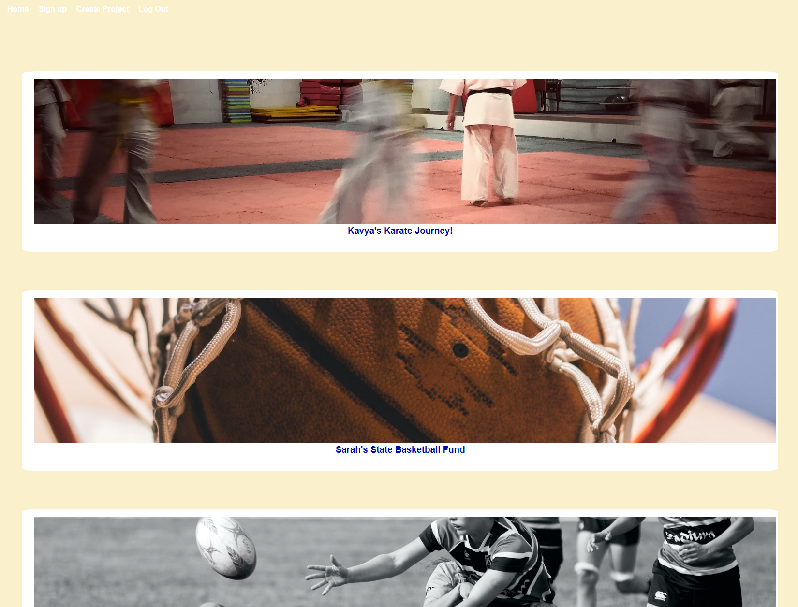
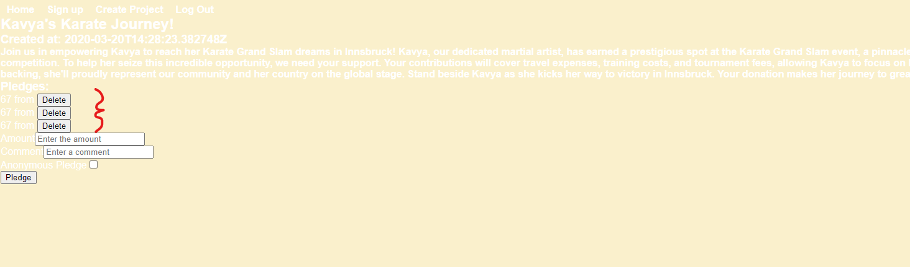

# React + Vite

This template provides a minimal setup to get React working in Vite with HMR and some ESLint rules.

Currently, two official plugins are available:

- [@vitejs/plugin-react](https://github.com/vitejs/vite-plugin-react/blob/main/packages/plugin-react/README.md) uses [Babel](https://babeljs.io/) for Fast Refresh
- [@vitejs/plugin-react-swc](https://github.com/vitejs/vite-plugin-react-swc) uses [SWC](https://swc.rs/) for Fast Refresh

## She Sports - https://shesports.netlify.app/
by Dee - She Codes crowdfunding project - React Frontend

## About
The website aims to empower women between the ages of 10 and 35 by offering diverse funding opportunities for various sporting needs. From covering travel expenses to acquiring equipment, uniforms, and coaching services, it's a platform dedicated to supporting female athletes in their athletic pursuits.

## Features
* Ability to pledge
* Create a project page.
* Allow users to pledge to a project.

## Homepage

## Project Creation

## Pledge Creation
You can also delete pledges by clicking delete button.
